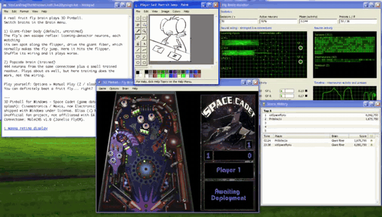

<div align="center">

```
 .-~*~--~*~--~*~--~*~--~*~--~*~--~*~--~*~--~*~--~*~--~*~--~*~--~*~-.
 |                                                                  |
 |      D  R  O  S  O  P  H  I  L  A         C  A  D  E  T          |
 |                                                                  |
 |          ~ a real fruit-fly brain plays 3D Pinball ~             |
 |                                                                  |
 '-~*~--~*~--~*~--~*~--~*~--~*~--~*~--~*~--~*~--~*~--~*~--~*~--~*~-'
                  \     /                                        
              .-.  \   /  .-.          "Ship Re-Fueled"          
             (   ) (o o) (   )               ...he says.  ^_^    
              '-'   \_/   '-'                                    
                    /|\                                          
```



# Watch a fly play 3D Pinball. &nbsp; `\(^o^)/`

```
+--------------------------------------------------------------------+
|  [ WELCOME ]  ............................................  [_][X] |
+--------------------------------------------------------------------+
```
https://seky443.github.io/3Dpinball-DrosophilaCadet/

**Plz use Chrome for better experience.**

</div>


The flippers of *3D Pinball for Windows - Space Cadet* are driven by the fruit fly's own
looming-escape circuit, taken straight from the real **MaleCNS v1.0** connectome (Janelia FlyEM):
the LC4 and LPLC2 visual neurons feeding the two **giant fibers (DNp01)**, 373 neurons in all, with
real synapse counts and signs. **Nothing in the circuit is trained** - only the "body" around it is
set up: each looming cell watches its own spot along a flipper, and a giant fiber that fires
presses its flipper. Everything runs in your browser, on a Windows XP desktop. &nbsp; `:-)`

```
   ___________________________________________________________
  |                                                           |
  |  ball looms at a flipper  -->  LC4 / LPLC2  -->  DNp01    |
  |      (seen by the fly)         (the eyes)     (giant      |
  |                                                fiber)     |
  |                                    |                      |
  |                                    v                      |
  |                       the fly "jumps"  ==>  FLIP!   o_O   |
  |___________________________________________________________|
```

## Main result &nbsp; `<(^_^)>`

- The **untrained** escape circuit plays about as well as a **trained** 444-neuron brain from
  the same connectome.
- Its **real wiring beats randomly shuffled wiring** (six degree-preserving shuffles, same
  tuning, same press budget, 96 paired lives each). For the trained brain the wiring does not
  matter at all - training does the work there.
- Both are still a little below a hand-written reflex. &nbsp; `>_<`
- This is a simplified rate model and the comparison was framed after the fact; methods, all
  numbers and the limitations are in the paper: **[docs/paper/technical_report.pdf](docs/paper/technical_report.pdf)**.

## The desktop &nbsp; `B-)`

```
  .--------------------.   .--------------------.   .--------------------.
  | 3D Pinball         |   | Fly Brain Monitor  |   | Score History      |
  |  the game, with    |   |  live wiring,      |   |  every game, a     |
  |  the fly at the    |   |  neuron activity,  |   |  Top 5 and a house |
  |  flippers          |   |  giant-fiber bars  |   |  record to beat    |
  '--------------------'   '--------------------'   '--------------------'
  .--------------------.   .--------------------.
  | Paint              |   | Notepad            |
  |  the fly's self-   |   |  what you are      |
  |  portrait, pressing|   |  looking at        |
  |  the keys          |   |                    |
  '--------------------'   '--------------------'
```

- Two brains in the **Brain** menu: the giant-fiber body (default) and the trained brain.
- **Options > Manual Play** lets you take the flippers yourself (Z and /). You can definitely beat
  a fruit fly... right? &nbsp; `;-)`
- Low-res mode for that 2003 LCD feeling, not available on WebKit Based browser (switch it off in Notepad: *i wanna retina display*). 
- Works on phones too (stacked windows, touch buttons), but it is best watched on a PC.

## Quick start &nbsp; `\m/`

Game data is not included: you need your own copy of the original game files (`CADET.DAT` or
`PINBALL.DAT` for the native build, placed in `vendor/SpaceCadetPinball/bin/`; the WASM build
packages `vendor/SpaceCadetPinball/bin/DEMO.DAT`). The web build reads the sound effects from
`assets/original/sound/`.

```sh
git submodule update --init --recursive        # engine + vendor/nfly
brew install sdl2 sdl2_mixer cmake             # macOS; Xcode CLT license must be accepted
./scripts/build_native.sh                      # applies src_cpp/patches, builds the engine

python3 -m venv .venv && source .venv/bin/activate
pip install -r agents/requirements.txt         # note: the CMA-ES trainer also imports `cma` (pycma)
python3 scripts/smoke_ipc.py                   # wire-protocol smoke test, no game data needed

# Paired evaluation: real giant-fiber body vs six shuffles, lead1 reflex and never-press
python3 agents/experiments/pathway_body/eval_gf_body.py --seeds 77000:77096 --suffix _budget --shuffles 1,2,3,4,5,6

# Browser demo (needs web/dist, built below)
./scripts/build_wasm.sh                        # needs Emscripten (CI pins 6.0.10) and DEMO.DAT
python3 scripts/serve_web.py --bind 127.0.0.1 --port 4242    # open http://127.0.0.1:4242/
```

## Repository layout &nbsp; `[o_o]`

```
DrosophilaCadet/
|-- vendor/SpaceCadetPinball   upstream decompilation (k4zmu2a), unmodified submodule
|-- vendor/nfly                MaleCNS loader / RL tooling (submodule)
|-- src_cpp/                   IPC server, state export, WASM bridge, patches 0001-0011
|-- env_python/                IPC client + the Gymnasium environment PinballEnv
|-- agents/                    circuit builders, CMA-ES trainer, fixed-circuit agent
|   `-- experiments/           every study, with its logs and results
|-- web/                       the XP-desktop demo; web/test/ = JS-vs-Python parity tests
|-- scripts/                   native/WASM builds, web server, web exports, Colab helpers
|-- assets/                    original sound effects + the self-portrait drawings
|-- data/                      MaleCNS v1.0 download (gitignored, ~1.1 GB)
`-- docs/                      the paper (PDF) and the demo GIF
```

## References &nbsp; `:-B`

- Ache JM, Polsky J, Alghailani S, Parekh R, Breads P, Peek MY, Bock DD, von Reyn CR, Card GM (2019). Neural basis for looming size and velocity encoding in the Drosophila giant fiber escape pathway. *Current Biology* 29(6).
- von Reyn CR, Nern A, Williamson WR, Breads P, Wu M, Namiki S, Card GM (2017). Feature integration drives probabilistic behavior in the Drosophila escape response. *Neuron* 94(6).
- von Reyn CR, Breads P, Peek MY, Zheng GZ, Williamson WR, Yee AL, Leonardo A, Card GM (2014). A spike-timing mechanism for action selection. *Nature Neuroscience* 17(7).
- Card G, Dickinson MH (2008). Visually mediated motor planning in the escape response of Drosophila. *Current Biology* 18(17).
- Ross S, Gordon GJ, Bagnell JA (2011). A reduction of imitation learning and structured prediction to no-regret online learning (DAgger). *AISTATS*.
- Hansen N, Ostermeier A (2001). Completely derandomized self-adaptation in evolution strategies (CMA-ES). *Evolutionary Computation* 9(2).
- Stefan Judis, "An SVG filter to pixelate images" - https://www.stefanjudis.com/snippets/an-svg-filter-to-pixelate-images/ - basis of the low-res pixel filter.
- SpaceCadetPinball decompilation by k4zmu2a - https://github.com/k4zmu2a/SpaceCadetPinball - the engine base.

## Copyright and licenses &nbsp; `(c)`

- **This repository's own code:** MIT License (see `LICENSE`).
- **Engine:** `vendor/SpaceCadetPinball` is MIT licensed, (c) 2020-2021 Andrey Muzychenko (`vendor/SpaceCadetPinball/LICENSE`); the patches in `src_cpp/patches/` apply on top of it. `vendor/nfly` (Zhengxu Yu, https://github.com/zhengxuyu/nfly) is MIT licensed.
- **Game assets:** the game data, sounds and splash of *3D Pinball for Windows - Space Cadet* are (c) Cinematronics / Maxis, now Electronic Arts, and were shipped with Windows under license. They are not in the repository except the sound effects in `assets/original/sound/` (committed because the WASM build needs them) and `web/splash.png`; the game data file (`DEMO.DAT`/`CADET.DAT`/`PINBALL.DAT`) is never committed.
- **Bliss** wallpaper (`web/bliss.jpg`) is (c) Microsoft.
- The Windows XP look-alike UI is a fan recreation; this project is unofficial and not affiliated with Microsoft or Electronic Arts. No fonts are bundled (the page uses the visitor's system fonts).
- **Connectome data:** MaleCNS v1.0 (Janelia FlyEM, HHMI Janelia Research Campus, with the University of Cambridge, MRC LMB and Google Research), CC-BY 4.0, https://male-cns.janelia.org/. Citation: Berg S, Beckett IR, Costa M, Schlegel P, Januszewski M, Marin EC, Nern A, et al. Sexual dimorphism in the complete connectome of the Drosophila male central nervous system. *Cell* (2026); bioRxiv 2025.10.09.680999, https://doi.org/10.1101/2025.10.09.680999 (as given in `vendor/nfly/README.md`).
- **Drawings** in `assets/drawings/` (the Paint self-portrait) are by the repository author.
- The original assets are included for a non-commercial fan project, with attribution, and will be removed on request by the rights holders.

<div align="center">

```
  ~*~ thanks for visiting ~*~   you are visitor no. 000001   ~*~ sign my guestbook ~*~

                         best viewed in 1024x768
          (I just wanna make this looks like it's come from 2004)
```

`(^_^)/~~  bye bye!`

</div>
